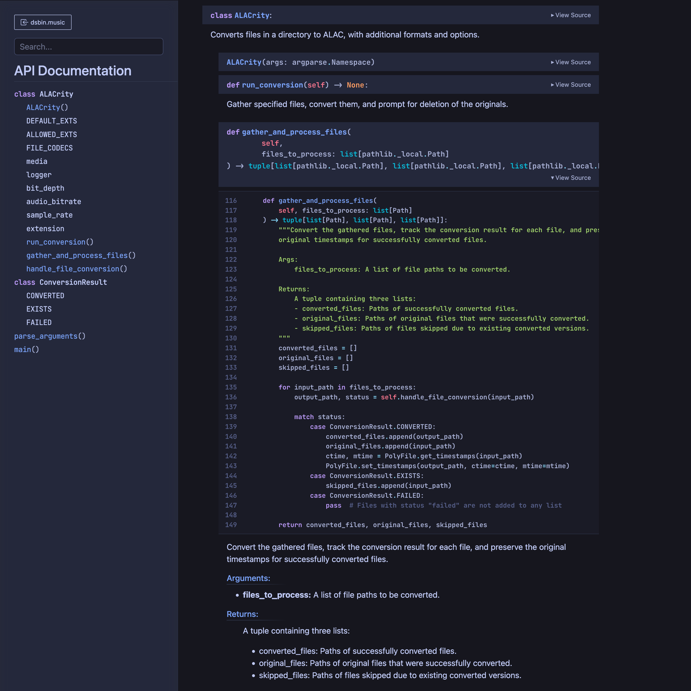

# Tokyo Night for pdoc

Disappointed with the lack of good dark themes for pdoc, I created my own based on [Tokyo Night](https://github.com/tokyo-night/tokyo-night-vscode-theme) with a hint of my other favorite theme [Moonic](https://github.com/yusoofsh/moonic). It uses [JetBrains Mono](https://www.jetbrains.com/lp/mono/) for code formatting.

</img>

## Usage

1. Save `theme.css` and `syntax-highlighting.css` from the `theme` folder into a folder of your choosing
2. Run `pdoc -t` pointing to that folder, using `pdoc-tokyo-night` as an example:

```bash
pdoc -t pdoc-tokyo-night $PKG_NAME
```

I hope it helps ~~brighten~~ darken up your documentation. Enjoy!
